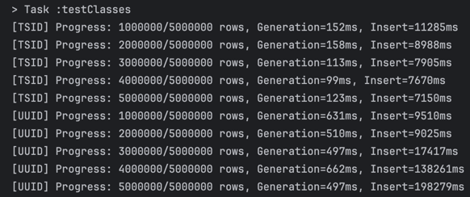
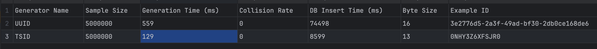
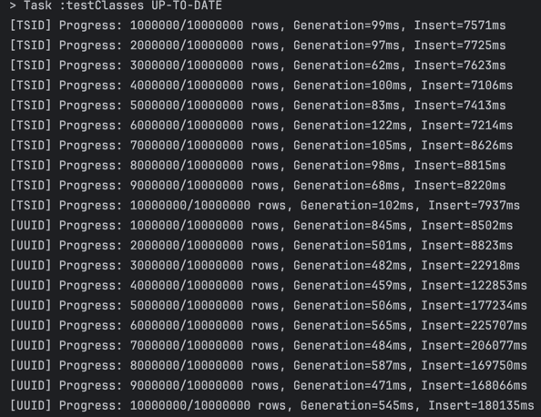
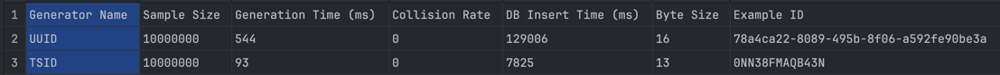

# UUID v4 vs TSID

## 500만건 테스트

---

## 1000만건 테스트

---

UUID v4는 완전 랜덤한 값이라, 새 레코드가 항상 인덱스 트리의 임의 위치에 삽입된다.
초반에는 인덱스 전체가 버퍼 풀에 대부분 올라와 있어, 랜덤 접근이라도 메모리 안에서 처리되며 큰 문제가 드러나지 않는다.
하지만 데이터가 수백만 건 규모로 커지면 인덱스 페이지 수가 급격히 늘어나고, 더 이상 전체를 메모리에 유지할 수 없게 된다.
이 시점부터는 삽입할 때마다 필요한 인덱스 페이지가 버퍼 풀에 없을 확률이 커지고, 디스크에서 해당 페이지를 읽어와야 하는 랜덤 I/O가 잦아진다.
동시에, 중간 위치에 반복해서 끼워 넣으면서 페이지 split과 인덱스 단편화가 누적되고, 같은 양의 데이터를 다루기 위해 더 많은 페이지를 오가야 한다.

이 두 가지가 겹치면서 300만 건를 넘는 시점부터는, 삽입 1건당 필요한 디스크 작업량이 계단식으로 증가하며 INSERT 시간이 눈에 띄게 폭증하게 된다.
